# Real vs simulated?

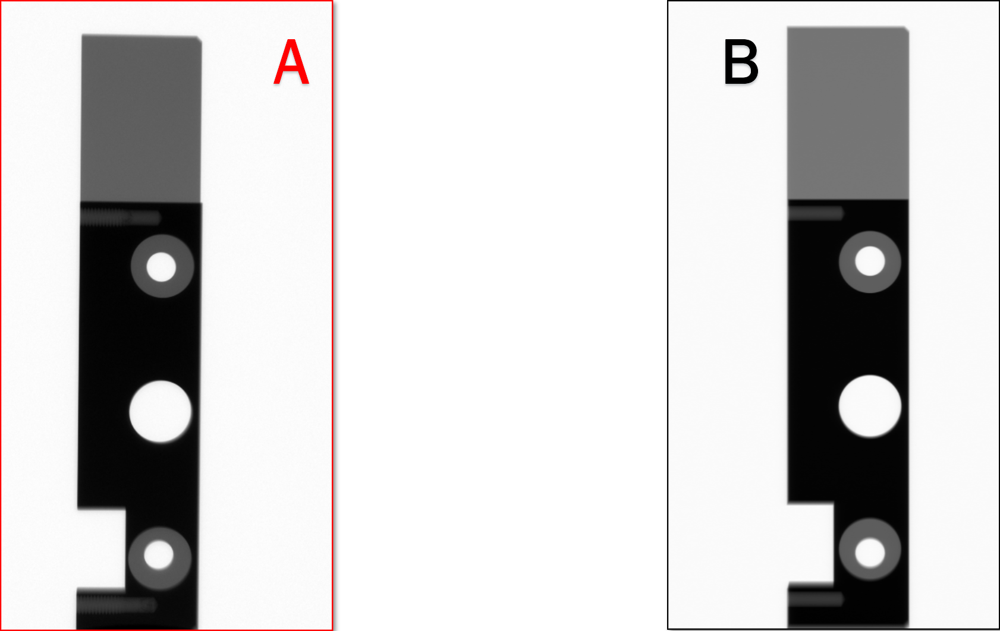{ width=70% }

# Real vs simulated?

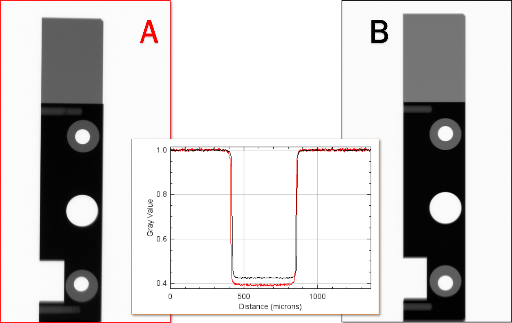{ width=70% }

# Aims of this session

- Discover what gVXR is;
- Become familiar with the Beer-Lambert law to compute the attenuation of X-rays by matter;
- Describe how the Beer-Lambert law is implemented in gVirtualXray;  
- Learn how to generate realistic, XCT projection data using the [**gVXR** package](https://gvirtualxray.sourceforge. io/); and 
- Focus on building simulation setups that mirror practical XCT scenarios. 

# Contents

1. What is gVXR and what do people do with it?
2. What can we scan?
3. Beer/Lambert law (also known as attenuation law) 
4. What are the main built-in functionalities?
5. Is gVXR validated?
5. How to simulate a CT acquisition?
6. How to use gVXR?
7. Other ways to use gVXR?


<!--
:::::::::::::: {.columns}
::: {.column width="40%"}
contents...
:::
::: {.column width=100%}
contents...
:::
::::::::::::::
-->

# 1. What is gVirtualXray (gVXR)?

::::: columns
::: column
{width=30%}<br/>
[https://gvirtualxray.sourceforge.io/](https://gvirtualxray.sourceforge.io/)

- API (application programming interface)
- relying on the **Beer-Lambert law**
- to simulate X-ray images in realtime on a GPU (graphics processor
  unit)
- using triangular meshes.
:::

::: column
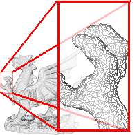{width=50%}
:::
:::::

> It is an alternative to Monte Carlo methods when scattering^1^ can be ignored or speed is required.

::: footer
^1^ Scattering may be added in the future
:::

# What do people do with gVXR?

::::: columns
::: column
Used in a wide range of applications, including:

- real-time medical simulators;
- proposing new imaging methods;
- prototype algorithms;
- studying noise removal techniques;
- teaching particle physics and x-ray imaging (250 students / year);
- predicting image quality and artifacts;
- optimise scans; and 
- a lot of ML/AI nowadays.
:::

::: column
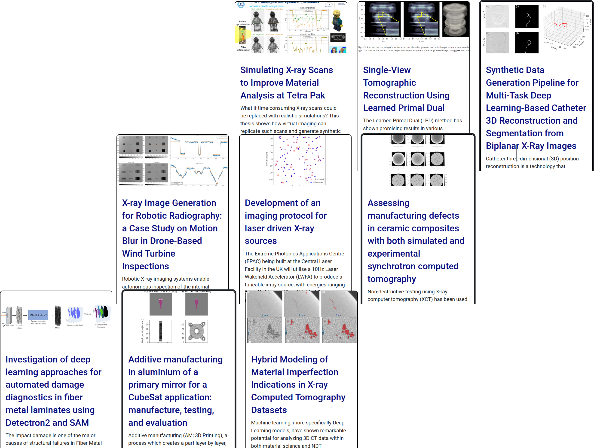{width=100%}
:::
:::::

# How to cite?

Vidal, F.P.; Afshari, S.; Ahmed, S.; Albiol, A.; Albiol, F.; Béchet, É.; Bellot, A.C.; Bosse, S.; Burkhard, S.; 
Chahid, Y.; et al. X-ray simulations with gVXR in education, digital twining, experiment planning, and data analysis.
Nucl. Instrum. Methods Phys. Res. Sect. B 2025, 568, 165804. doi: [10.1016/j.nimb.2025.165804](https://doi.org/10.1016/j.nimb.2025.165804)
<br/>
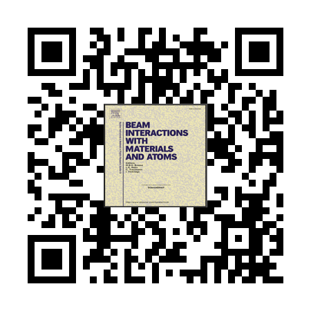{width=10%}

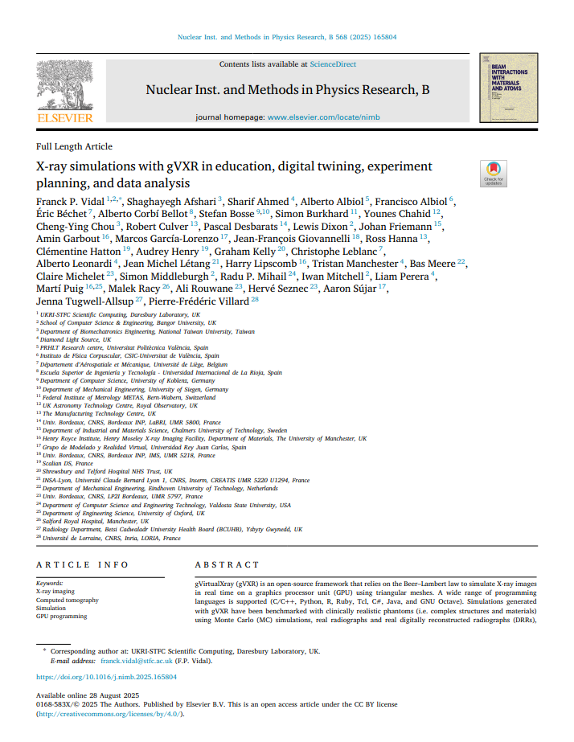{width=50%}

# Implementation

- R&D started in the early 2000s, VXI^1^ by Nicolas Freud (INSA-Lyon),
  and
- Its port on GPU when they became programmable (Bangor University,
  2007);
- Not a ray tracer, but a rasterizer!
- Reimplementation from scratch as open source project on { height=30px }
  - Registered on 2013-12-01;
  - 4544 commits on 2026-09-09 (v2.1.0). (average of 1.5 commit a working day in 12.5 years)
  - Implemented in { height=30px } using { height=30px }
    - 173 C++ source files, 21036 lines of comments, 89950 lines of code
    - 123 C++ header files, 17482 lines of comments, 61203 lines of code
    - 69 CMake files, 1686 lines of comments, 5273 lines of code
    - 81 GLSL files, 4249 lines of comments, 2965 lines of code
    - 599 source code files, 49881 lines of comments, 199341 lines of code
  - Wrapper for { height=30px }, 
    { height=30px },
    { height=30px },
    { height=30px },
    { height=30px }, 
    { height=30px }, and 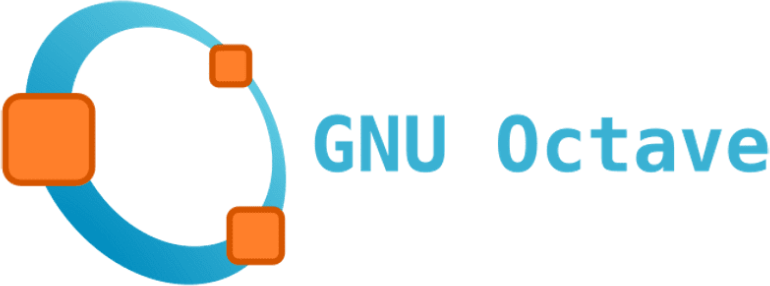{ height=30px }.

::: footer
^1^ Freud et al. (2006), “Fast and robust ray casting algorithms for virtual X-ray imaging”
:::

# Rasterisation

::::: columns
::: column
✅ How it works

 - Converts 3D geometry (triangles) into 2D pixels. 
 - Projects objects onto a screen from the camera’s perspective.
 - Determines which pixels belong to which triangles.
 - Applies shading, textures, and lighting approximations.

⚡ Key strengths

- Very fast → ideal for real-time applications (games)
- Hardware optimized (GPUs have dedicated raster units)
- Efficient for large, complex scenes
:::

::: column

:::
::::

# Ray Tracing (Physically-Based Rendering)

::::: columns
::: column
✅ How it works

  - Simulates rays of light:
    - Rays shoot from the camera into the scene
    - They bounce between surfaces
    - Lighting is calculated based on physical interactions
  - Handles reflection, refraction, shadows naturally

⚡ Key strengths

  - Highly realistic lighting
  - Accurate reflections, shadows, translucency
  - Global illumination emerges naturally
:::

::: column

:::
::::

# Ray Tracing vs Rasterisation

::::: columns
::: column
|    Feature     |       Rasterisation        |         Ray Tracing          |
|:--------------|:--------------------------|:----------------------------|
|     Speed      |   Very fast (real-time)    |    Slower (compute heavy)    |
|    Realism     |        Approximate         |       Highly realistic       |
|    Lighting    |    Precomputed / tricks    |     Physically accurate      |
|    Shadows     |        Shadow maps         |     Natural soft shadows     |
|  Reflections   |  Screen-space / cube maps  |       True reflections       |
|  Typical Use   |   Games, real-time apps    |  Film, high-end, RTX games   |
:::

::: column
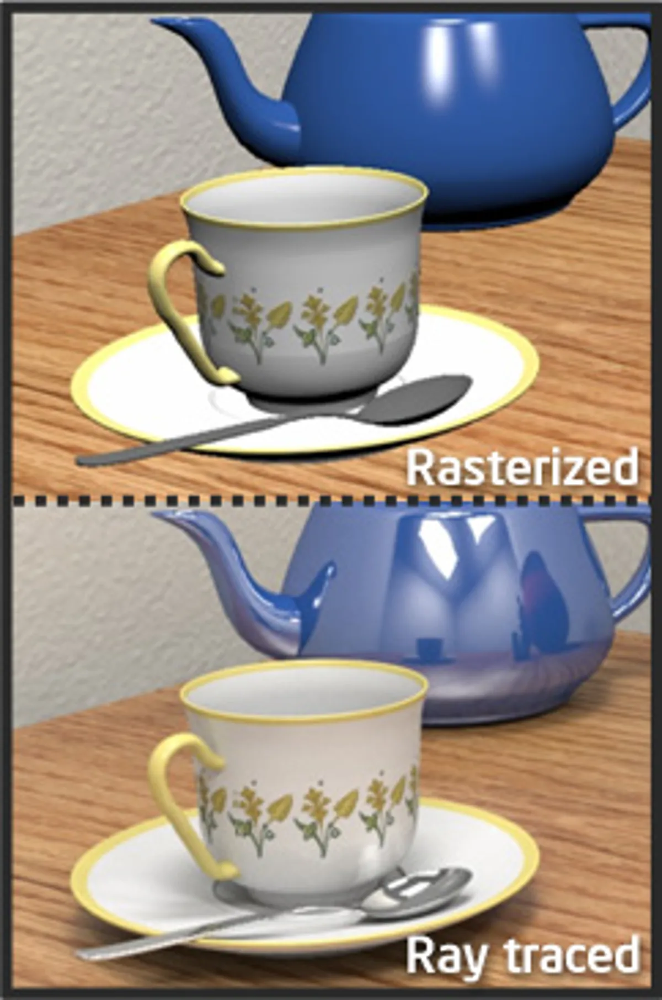{width=30%}
:::
::::

# Cross-platform

::::: columns
::: column
- Operating systems: 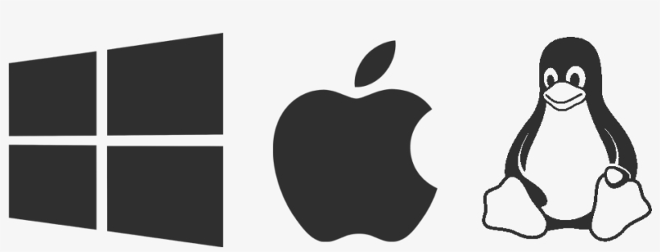{height=50px}
  (binaries for MacOS are no longer distributed)
- CPUs:
  - 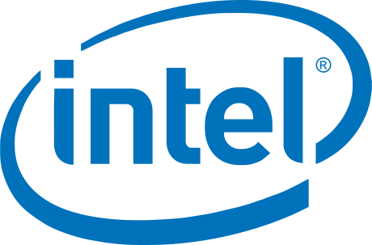{height=50px}<br/>
  - {height=50px}<br/>
  - {height=50px}<br/>
- GPUs:
  - 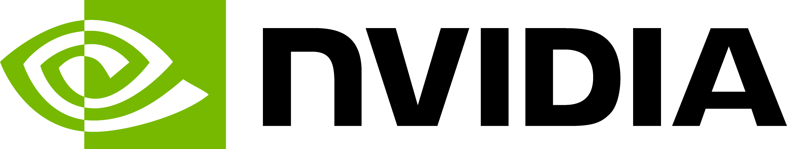{height=50px}<br/>
  - {height=50px}<br/>
  - {height=50px}<br/>
  - {height=50px} (software rendering with Mesa 3D)<br/>
:::

::: column
- Computers:
  - On-board computers (OBCs) 
    - 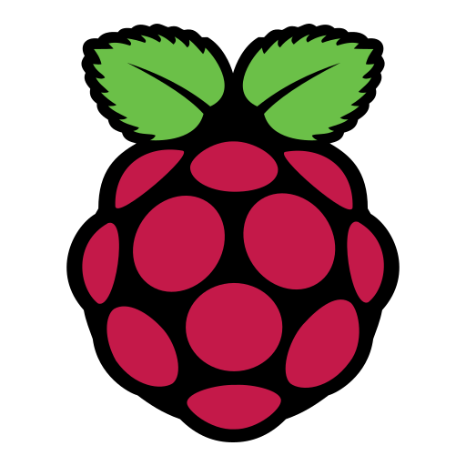{height=50px}<br/>
    - {height=50px} Jetson
  - Personal computers (PCs)
    - {height=50px}<br/>
    - 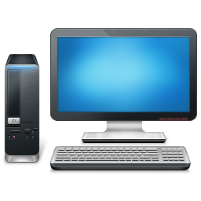{height=50px}<br/>
  - Data center and High-performance computing (HPC) systems
    - STFC SCARF
    - {height=50px}<br/>
    - {height=50px} Google Colab<br/>
    - {height=50px} (used for reproducible research)
- Containerisation with {height=50px}<br/>
:::
:::::

# Easy installation for {height=60px}

- Available on 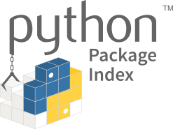{height=90px}: [https://pypi.org/project/gvxr/](https://pypi.org/project/gvxr/)
- For MS Windows (x86_64 architecture only);
- GNU/Linux (x86_64 and aarch64 architectures)

``` {numbers="none"}
pip install gvxr
```
# Jupyter Notebook 1: Test installation
- [test_installation.ipynb](https://github.com/TomographicImaging/gVXR-Tutorials/tree/main/notebooks/test_installation.ipynb)
- Run the quick test scripts provided with gVirtualXray's Python package to make sure the installation is working 
  well on your system.
- [](https://colab.research.google.com/github/TomographicImaging/gVXR-Tutorials/blob/main/notebooks/test_installation.ipynb)

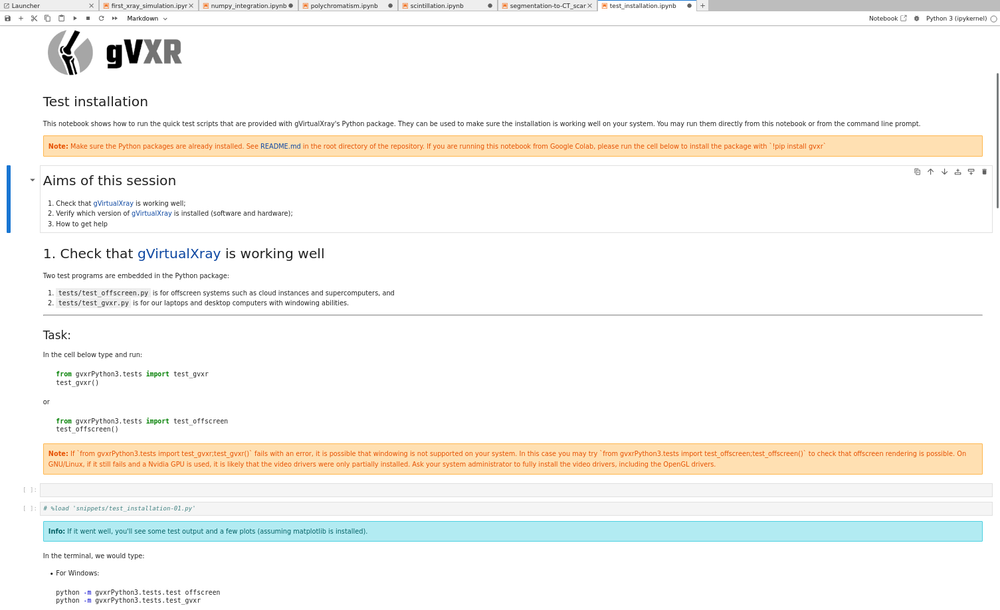{width=50%}<br/>

# 2. What can we scan?

- Surface mesh from files (all common formats are supported, inc. STL)


](img/models/Welsh_dragon-statue.jpg){ width=10% }

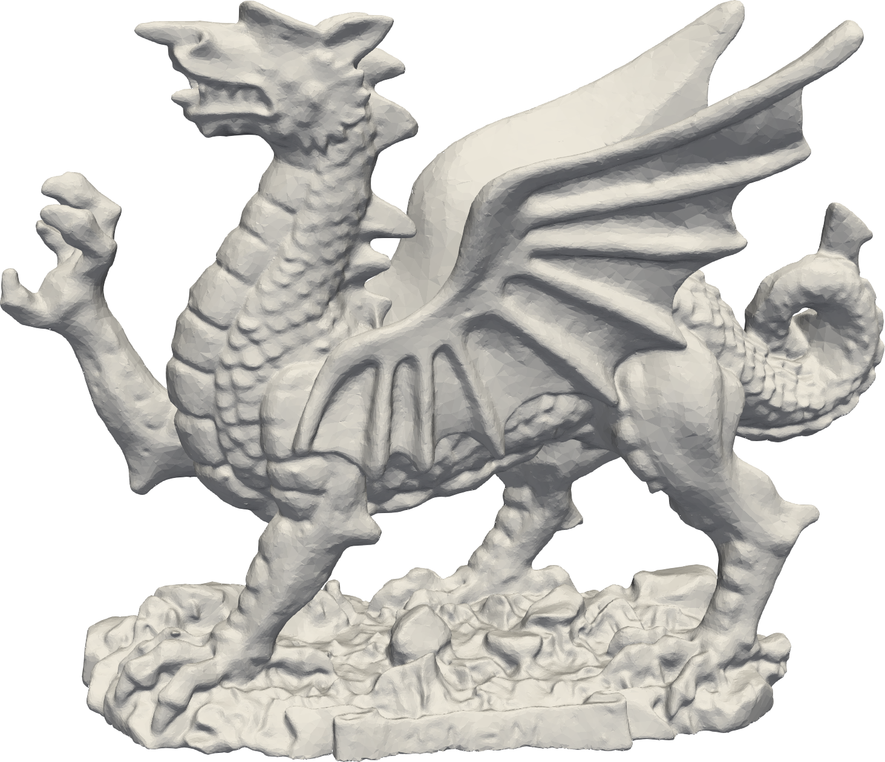{ width=30% }

# 2. What can we scan?

- Surface mesh from files (all common formats are supported, inc. STL)
- Multi-part models using multiple different materials

).](img/models/pediatric_model.png){ 
width=15% }

# 2. What can we scan?

- Surface mesh from files (all common formats are supported, inc. STL)
- Multi-part models using multiple different materials
- Volume meshes (INP files from Abaqus, EXPERIMENTAL)

*Tooth model*

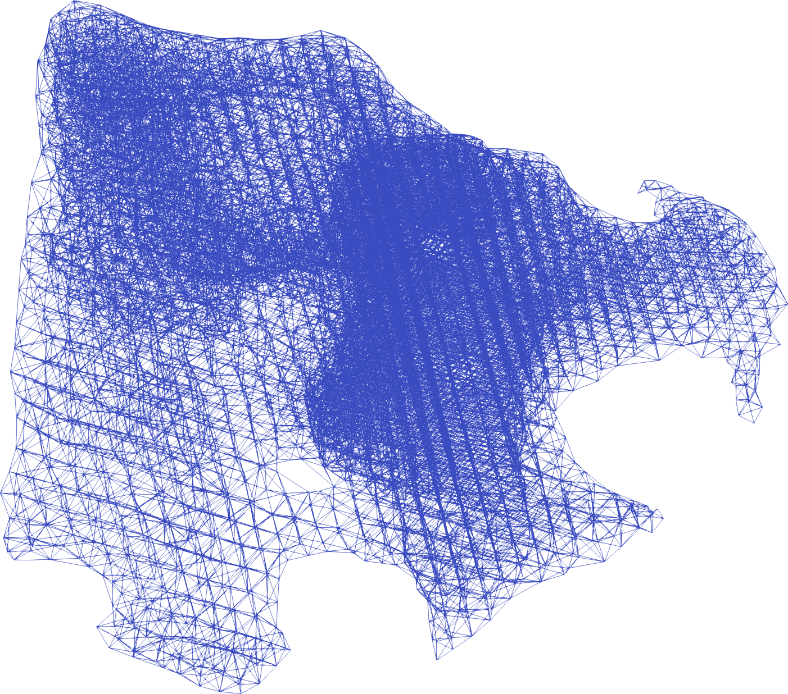{ width=30% }

# 2. What can we scan?

- Surface mesh from files (all common formats are supported, inc. STL)
- Multi-part models using multiple different materials
- Volume meshes (INP files from Abaqus, EXPERIMENTAL)
- Implicit modelling (organic-looking $n$-dimensional isosurfaces)

| Far from each other                                  | Getting closer                                        | Close from each other                                 | Positive + negative density fields                   |
|:----------------------------------------------------:|:-----------------------------------------------------:|:-----------------------------------------------------:|:----------------------------------------------------:|
| 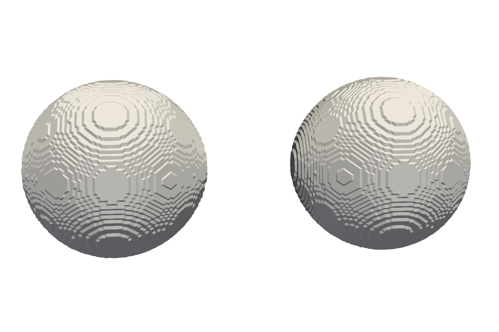{ width=80% } | 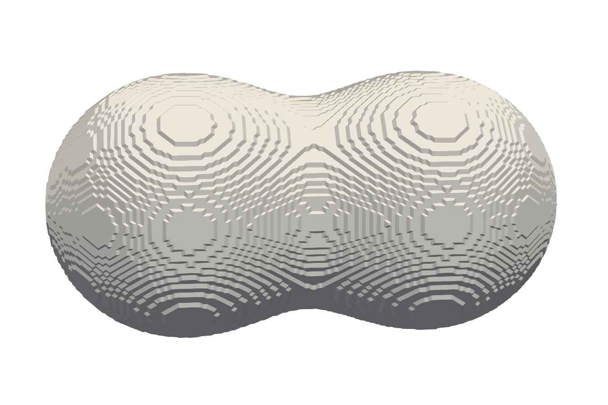{ width=80% } | 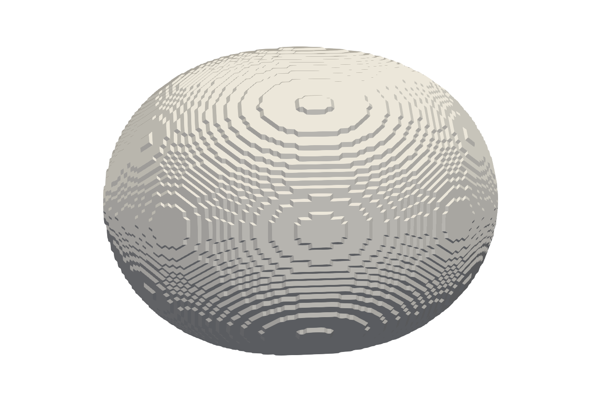{ width=80% } | 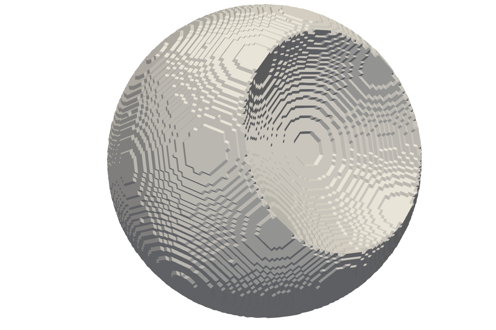{ width=80% } |

# 2. What can we scan?

- Surface mesh from files (all common formats are supported, inc. STL)
- Multi-part models using multiple different materials
- Volume meshes (INP files from Abaqus, EXPERIMENTAL)
- Implicit modelling (organic-looking $n$-dimensional isosurfaces)
- Customisable built-in phantoms

| Welsh dragon | Step wedge | Foam                                  | Geometric shapes                            | Lungman                                            |
|:------------:|:----------:|:-------------------------------------:|:-------------------------------------------:|:--------------------------------------------------:|
| { height=200px } | 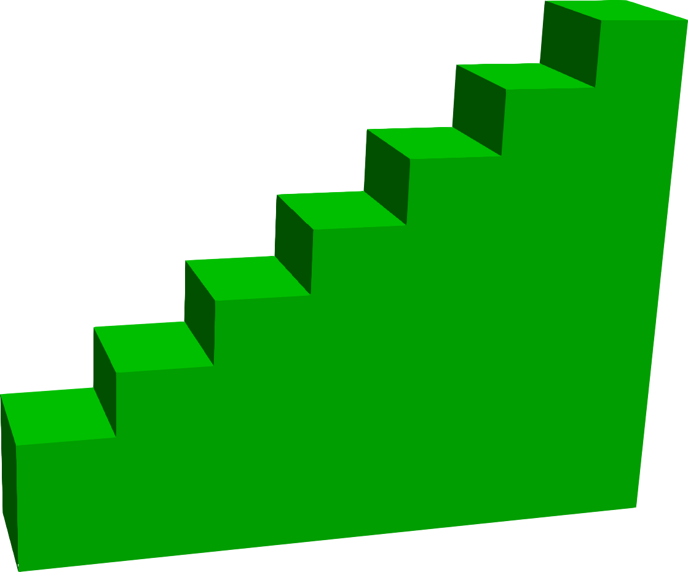{ height=200px } | 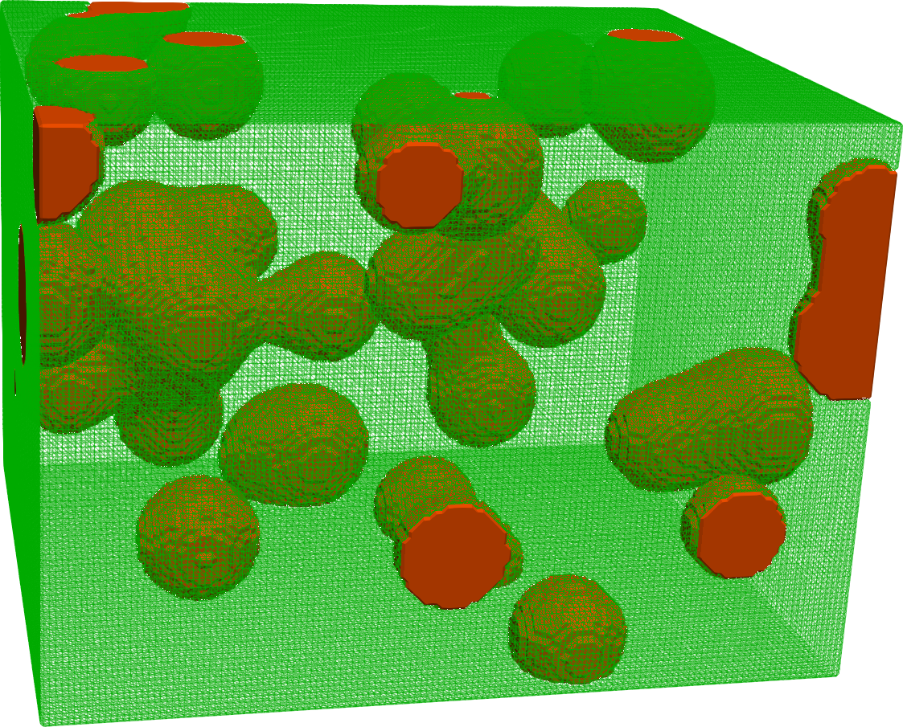{ height=200px } | 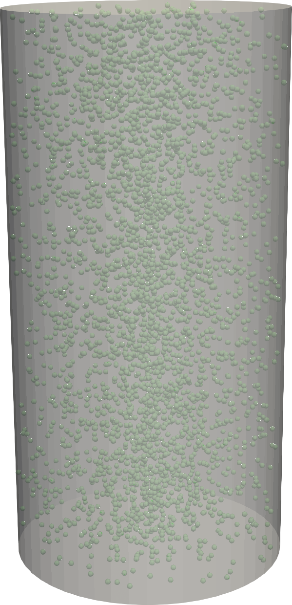{ height=200px } | { height=200px } |
 |                          | Fully customisable | Fully customisable | Cuboids, spheres, cylinders, | To appear |
 |                          |  |  | inc. boolean operations                     |  |

# 3. Beer-Lambert law (monochromatic)

$$
I_{mono}(x,y)  = 
  E \times \mathbf{D}(E) \; \exp\left({-\sum_i \mu_i
(E) \; \mathbf{d}_{i}(x,y)}\right)
$$

- $E$ is the Energy $E$ emitted by the source
- $\mathbf{D}(E)$ is the number of photons of Energy $E$ emitted by the source
- $\mu_i(E)$ is the linear attenuation coefficient at Energy $E$ of the
  $i$-th material;
- $\mathbf{d}_i(x, y)$ is the path length of the ray from the X-ray source to
  pixel $(x,y)$ crossing the $i$-th material.

# Jupyter Notebook 2: First X-ray simulation
- [first_xray_simulation.ipynb](https://github.com/TomographicImaging/gVXR-Tutorials/tree/main/notebooks/first_xray_simulation.ipynb)
- Explore the step-by-step notebook to create our first X-ray radiograph.
- A mono-material object is imaged with a monochromatic source and an ideal detector. 
- We show how to visualise the X-ray radiograph and take a screenshot of the 3D visualisation of the simulation environment.
- [](https://colab.research.google.com/github/TomographicImaging/gVXR-Tutorials/blob/main/notebooks/first_xray_simulation.ipynb)

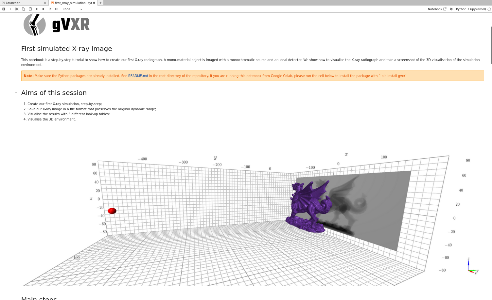{width=50%}<br/>

# Jupyter Notebook 3: Numpy integration
- [numpy_integration.ipynb](https://github.com/TomographicImaging/gVXR-Tutorials/tree/main/notebooks/numpy_integration.ipynb)
- Experiment with the Numpy integration to speed up the simulation by avoiding memory copies when the simulated data 
  must be accessed in Python.
- [](https://colab.research.google.com/github/TomographicImaging/gVXR-Tutorials/blob/main/notebooks/numpy_integration.ipynb)

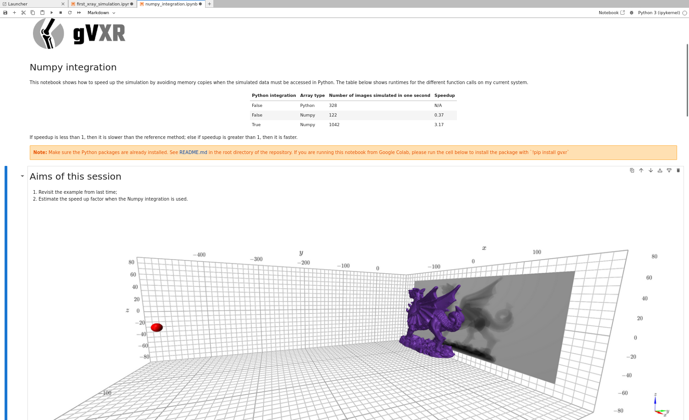{width=50%}<br/>

# Why was this notebook important: Advantage of NumPy arrays over Python Lists

- Memory preallocation;
- Memory efficiency;
- Associated speed of reads and writes;
- Benefit of all the Numpy functionalities on arrays (e.g. `min()`, `max()`, `average()`, `std()`, `+`, `-`, `*`, 
  `/`, etc.).

<style>
/*table th:first-of-type {*/
/*    width: 10%;*/
/*}*/
table th:nth-of-type(2) {
    width: 15%;
}
/*table th:nth-of-type(3) {*/
/*    width: 5%;*/
/*}*/
/*table th:nth-of-type(4) {*/
/*    width: 15%;*/
/*}*/
/*table th:nth-of-type(5) {*/
/*    width: 15%;*/
/*}*/
/*table th:nth-of-type(6) {*/
/*    width: 15%;*/
/*}*/
</style>


| Python integration | Array type | Number of images simulated in one second | Compute time for one image | Compute time for 1609 images | Speedup |
|:------------------:|:----------:|:----------------------------------------:|:--------------------------:|:----------------------------:|:-------:|
| False | Python lists | 320 | 3.12 ms | 5 s | N/A |
| False | Python lists to Numpy arrays | 124 | 8.09 ms | 13 s | 0.39 |
| True | Numpy arrays | 1269 | 0.79 ms | 1 s | 3.96 |

- Computed on:
  - OS: GNU/Linux -- openSUSE Leap 16.0
  - GPU: NVIDIA GeForce RTX 4060 Ti/PCIe/SSE2
  - OpenGL version: 4.3.0 NVIDIA 595.80

# 4. Built-in functionalities

::::: columns
::: column
1. **Flexible material composition**;
:::

::: column
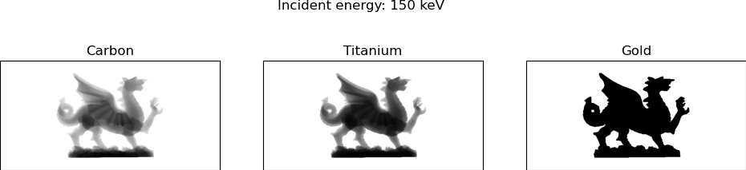{ width=80% }

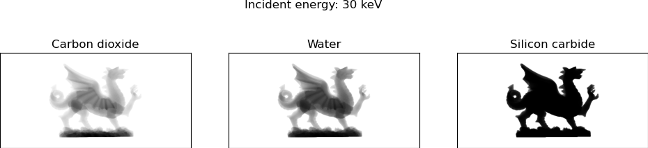{ width=80% }

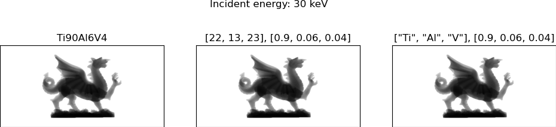{ width=80% }
:::
:::::

::: footer
^1^ Text in **bold characters** marks components validated against Monte Carlo simulations}
:::

# Jupyter Notebook 4: Multi-material sample
- [multi_material-lungman_phantom.ipynb](https://github.com/TomographicImaging/gVXR-Tutorials/tree/main/notebooks/multi_material-lungman_phantom.ipynb)
- In this notebook we practice, amongst other things, how to set simulation parameters related to the X-ray source 
  and detector; and
- demonstrate how to load several STL files and use them all in the simulation (multi-material).
- We aim to **replicate a digital radiograph (DR)** of the [Lungman anthropomorphic chest phantom](https://doi.org/10.
  1117/1.JMI.5.1.013504) (Kyoto Kagaku, Tokyo, Japan) taken with a clinical X-ray machine by GE Healthcare (Chicago, Illinois, USA) at one of our local hospitals (Glan Clwyd). 
- Parameters relevant to the simulation are extracted from the DICOM file, such as source-patient-distance and source-detector-distance.
- [](https://colab.research.google.com/github/TomographicImaging/gVXR-Tutorials/blob/main/notebooks/multi_material-lungman_phantom.ipynb)

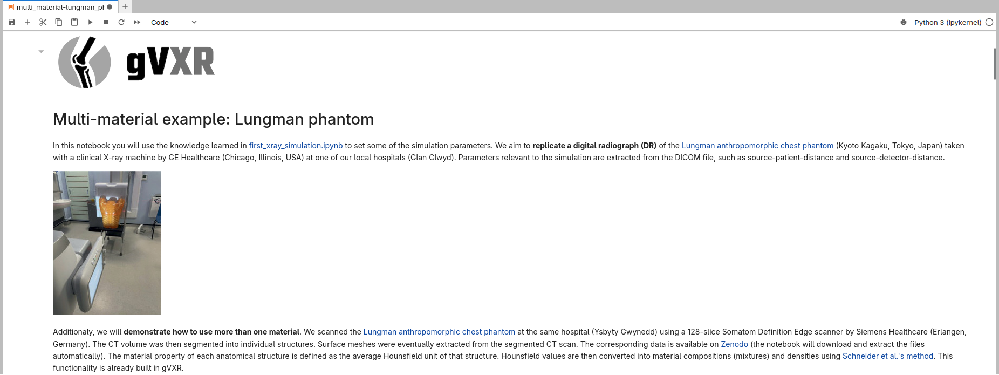{width=50%}<br/>


# 4. Built-in functionalities

::::: columns
::: column
1. **Flexible material composition**;
2. **Monochromatic** & **polychromatic** spectra:
:::

::: column
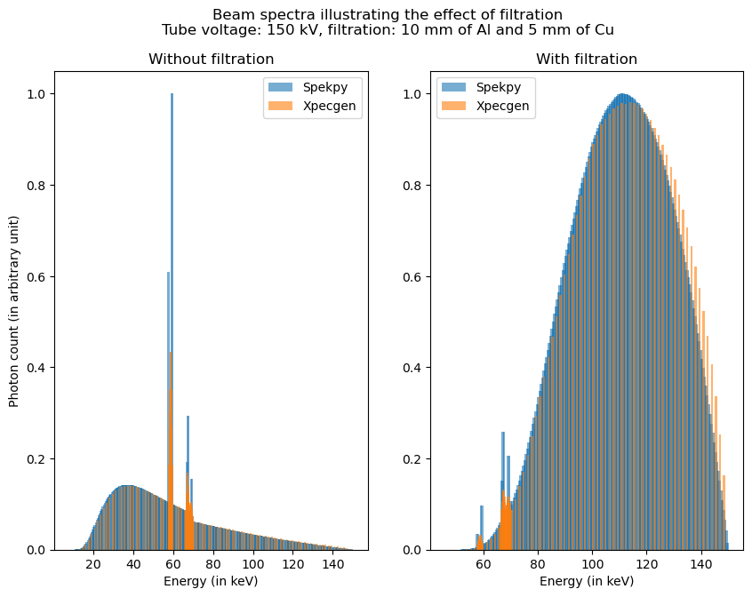{ width=80% }
:::
:::::

::: footer
^1^ Text in **bold characters** marks components validated against Monte Carlo simulations}
:::

# 4.2) Beer-Lambert law (polychromatic)

$$
I_{poly}(x,y)  = 
  \sum_j E_j \times \mathbf{D}(E_j) \; \exp\left({-\sum_i \mu_i
(E_j) \; \mathbf{d}_{i}(x,y)}\right)
$$

- **Polychromatism ($\sum_j$):** Images are integrated over $J$ energy bins.

# 4. Built-in functionalities

::::: columns
::: column
1. **Flexible material composition**;
2. **Monochromatic** & **polychromatic** spectra:
  - including kV and beam filtration;
:::

::: column
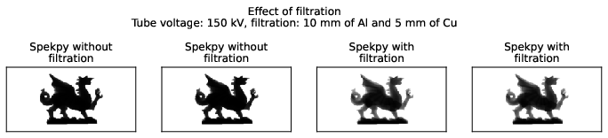{ width=100% }

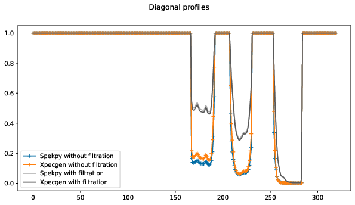{ width=80% }
:::
:::::

::: footer
^1^ Text in **bold characters** marks components validated against Monte Carlo simulations}
:::

# Jupyter Notebook 5: Polychromtic X-ray tube spectra
- [polychromatism.ipynb](https://github.com/TomographicImaging/gVXR-Tutorials/tree/main/notebooks/polychromatism.ipynb)
- In this notebook we explore how to specify polychromtic X-ray tube spectra, without and with filtration. 
- We also shows how to plot the spectrum. 
- [](https://colab.research.google.com/github/TomographicImaging/gVXR-Tutorials/blob/main/notebooks/polychromatism.ipynb)

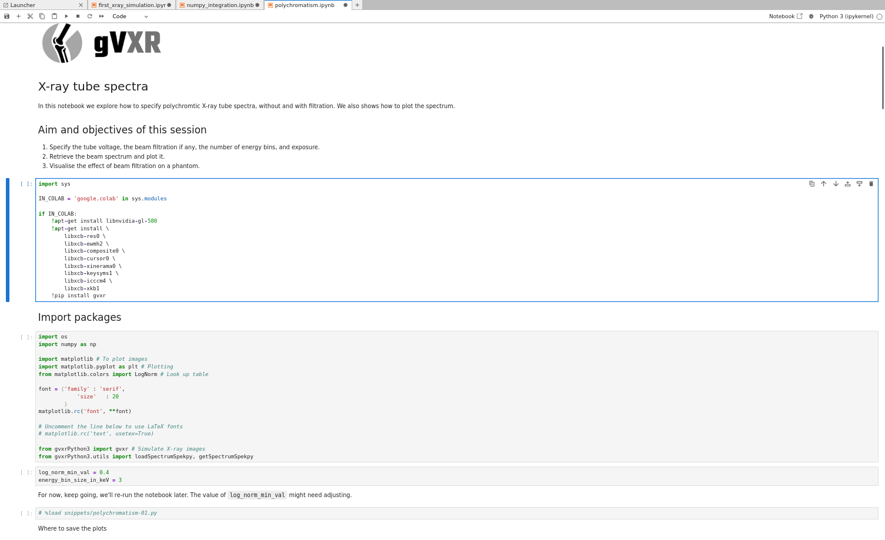{width=50%}<br/>

# 4. Built-in functionalities

::::: columns
::: column
1. **Flexible material composition**;
2. **Monochromatic** & **polychromatic** spectra:
  - including kV and beam filtration;
3. **Parallel beams**, **point sources**, & **focal spots**^1^;
:::

::: column
| Focal spot type | Size |
|:---------------:|:----:|
| Point | 0.0 mm |
| Cube | 0.25 &times; 0.25 &times; 0.25 mm |
| Square | 0.25 &times; 0.25 mm |
| Rectangle | 0.25 &times; 0.5 mm |
| Rectangle rotated by 25&deg; | 0.25 &times; 0.5 mm |

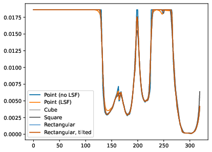{ width=60% }
:::
:::::

::: footer
^1^ Text in **bold characters** marks components validated against Monte Carlo simulations}
:::

# 4.3) Beer-Lambert law (polychromatic + focal spot)

$$
I_{FS}(x,y)  = 
  \sum_k \sum_j E_j \times \mathbf{D}(E_j) \; \exp\left({-\sum_i \mu_i
(E_j) \; \mathbf{d}_{i,k}(x,y)}\right)
$$

- **Focal spot $\left(\sum_k\right)$:** Images are integrated over $K$ point sources.

# 4. Built-in functionalities

::::: columns
::: column
1. **Flexible material composition**;
2. **Monochromatic** & **polychromatic** spectra:
  - including kV and beam filtration;
3. **Parallel beams**, **point sources**, & **focal spots**^1^;
4. **Scintillation**;
:::

::: column
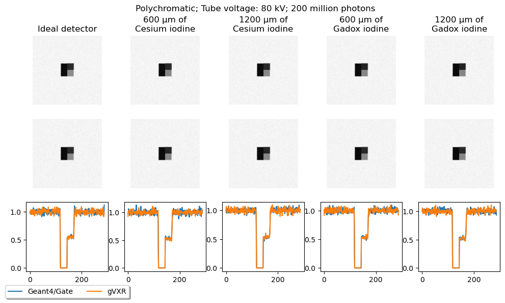{ width=100% }
:::
:::::

::: footer
^1^ Text in **bold characters** marks components validated against Monte Carlo simulations}
:::

# 4.4) Beer-Lambert law (polychromatic + focal spot + scintillation)

$$
I(x,y)  = 
  \sum_k \sum_j \mathrm{R}(E_j) \times \mathbf{D}(E_j) \; \exp\left({-\sum_i \mu_i
(E_j) \; \mathbf{d}_{i,k}(x,y)}\right)
$$

- **Scintillator $\left(\mathbf{R}(E_j)\right)$:** energy response of the detector, a lookup
  table.

# Jupyter Notebook 6: Scintillation
- [scintillation.ipynb](https://github.com/TomographicImaging/gVXR-Tutorials/tree/main/notebooks/scintillation.ipynb) 
- In this notebook we explore how to create a detector with a scintillator.
- We also shows how to plot the corresponding energy response. 
- [](https://colab.research.google.com/github/TomographicImaging/gVXR-Tutorials/blob/main/notebooks/scintillation.ipynb)

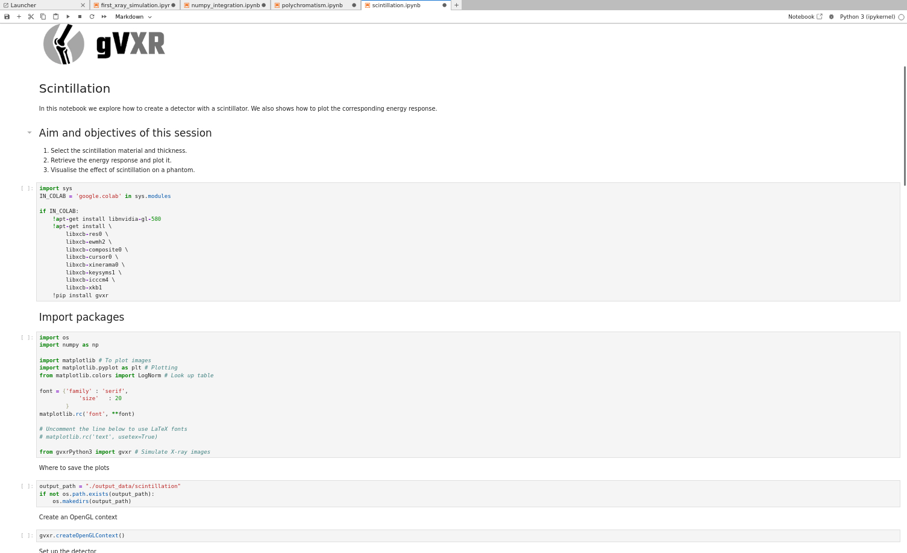{width=50%}<br/>

# 4. Built-in functionalities

::::: columns
::: column
1.  **Flexible material composition**;
2. **Monochromatic** & **polychromatic** spectra:
  - including kV and beam filtration;
3. **Parallel beams**, **point sources**, & **focal spots**^1^;
4. **Scintillation**;
5. Impulse response of detectors;
:::

::: column
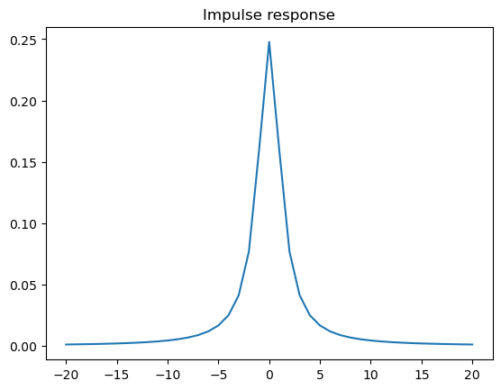{ width=20% }

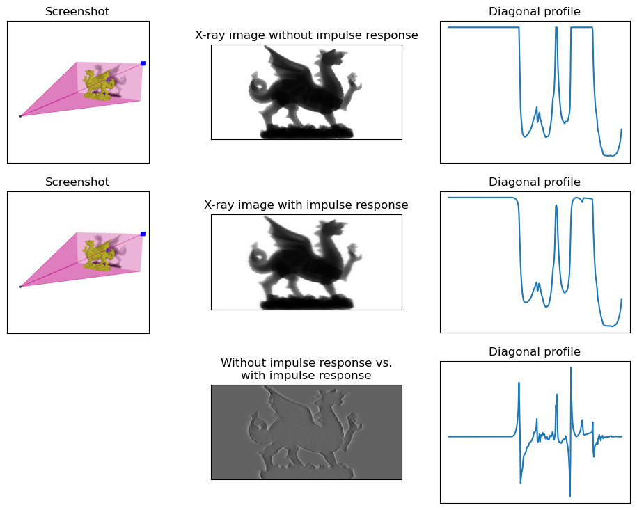{ width=50% }
:::
:::::


# 4.5) Beer-Lambert law (polychromatic + focal spot + scintillation + PSF)

$$
I_{PSF}(x,y)  = PSF * \sum_k \sum_j \mathbf{R}(E_j) \times \mathbf{D}(E_j) \; \exp\left({-\sum_i \mu_i
(E_j) \; \mathbf{d}_{i,k}(x,y)}\right)
$$

- **Detector blur $\left(PSF\right)$:** 2D impulse response of the detector, a low-pass convolution
  filter;
- $*$: spatial convolution operator.

 
# 4. Built-in functionalities

::::: columns
::: column
1. **Flexible material composition**;
2. **Monochromatic** & **polychromatic** spectra:
  - including kV and beam filtration;
3. **Parallel beams**, **point sources**, & **focal spots**^1^;
4. **Scintillation**;
5. Impulse response of detectors;
6. Noise (electronic & **photonic**).
:::

::: column
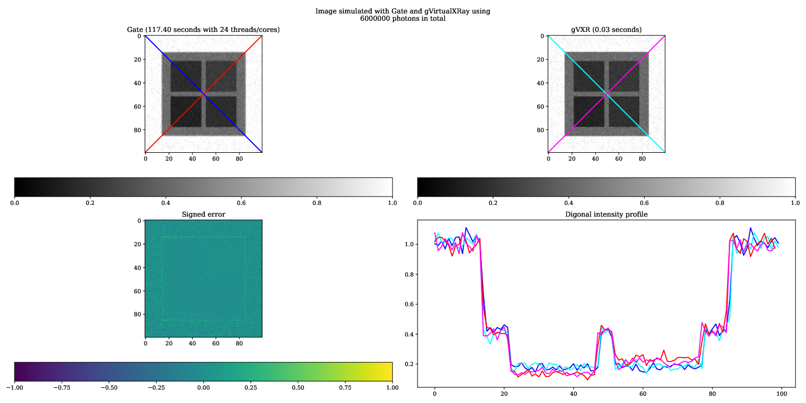{ width=100% }
:::
:::::

::: footer
^1^ Text in **bold characters** marks components validated against Monte Carlo simulations}
:::


# 4.6) Beer-Lambert law (polychromatic + focal spot + scintillation + PSF + electronic noise & photonic noise)

$$
I_{noisy}(x,y)  = \mathrm{Gauss}(\theta, \sigma) + gain \times 
  \left(PSF * \sum_k \sum_j \mathbf{R}(E_j) \times \mathrm{Poisson}\left(\mathbf{D}(E_j) \; \exp\left({-\sum_i \mu_i
(E_j) \; \mathbf{d}_{i,k}(x,y)}\right)\right)\right)
$$

- **Electronic noise $\left(\mathrm{Gauss}(\theta, \sigma)\right)$:** additive Gaussian noise of average $\theta$ 
  and standard deviation $\sigma$ corresponding to the dark field image
- **Detector gain $\left(gain\right)$:** a multiplicative factor
- **Photonic noise $\left(\mathrm{Poisson}\right)$:** Poisson noise that depends on the number of photons.

# 4.6) Final approximated model

- **Models of Poisson noise: computationally slow**;
- Complexity for previous slide: $\mathcal{O}(n^3)$: 
  - one call of $\mathrm{Poisson}()$
  - for every pixel 
    - for every energy bin 
      - for every focal spot source point 
- Approximation: $\mathcal{O}(n)$: one call for every pixel only.

$$
    e2p = \frac{\sum_j \mathbf{D}(E_j)}{\sum_j \mathbf{R}(E_j) \, \mathbf{D}(E_j)} = \frac{1}{p2e}
$$

- **Scaling factor ($e2p$):** convert an integrated energy ($I$) in into an approximated number of photons;
- **Scaling factor ($p2e$):** convert an approximated number of photons in an integrated energy.

$$
I_{final}(x,y)  = \mathrm{Gauss}(\theta, \sigma) + gain \times 
  \left(PSF * \left(p2e \times \mathrm{Poisson}\left(I(x,y)\times e2p\right)\right)\right)
$$

# 4. Built-in functionalities

::::: columns
::: column
1. **Flexible material composition**;
2. **Monochromatic** & **polychromatic** spectra:
  - including kV and beam filtration;
3. **Parallel beams**, **point sources**, & **focal spots**^1^;
4. **Scintillation**;
5. Impulse response of detectors;
6. Noise (electronic & **photonic**).
7. Interactive 3D visualization
:::

::: column
{ width=50% }
:::
:::::

::: footer
^1^ Text in **bold characters** marks components validated against Monte Carlo simulations}
:::


# Jupyter Notebook 7: 3D visualisation
- [visualisation.ipynb](https://github.com/TomographicImaging/gVXR-Tutorials/tree/main/notebooks/visualisation.ipynb)
-  Get familiar with the three different 3D visualisation methods provided with gVXR, including:
  1. K3D to interactively visualise the 3D scene in a Jupyter widget, 
  2. a customisable static 3D visualisation, and 
  3. an interactive 3D visualisation window.
- In this notebook you will also create a multi-material sample. 
- [](https://colab.research.google.com/github/TomographicImaging/gVXR-Tutorials/blob/main/notebooks/visualisation.ipynb)

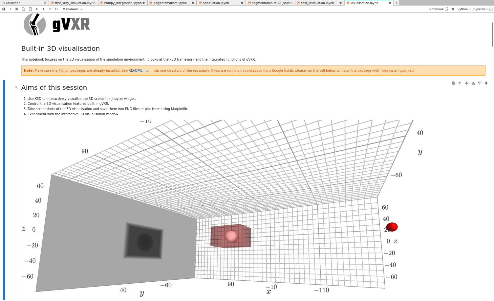{width=50%}<br/>

# 5. Is gVXR validated? ^1^

::::: columns
::: column
-   Against state-of-the art **Monte Carlo simulation**, namely Geant4/Gate
:::

::: column
**10 days with GATE vs. 1 second with gVirtualXray for 128 &times; 128 pixels**
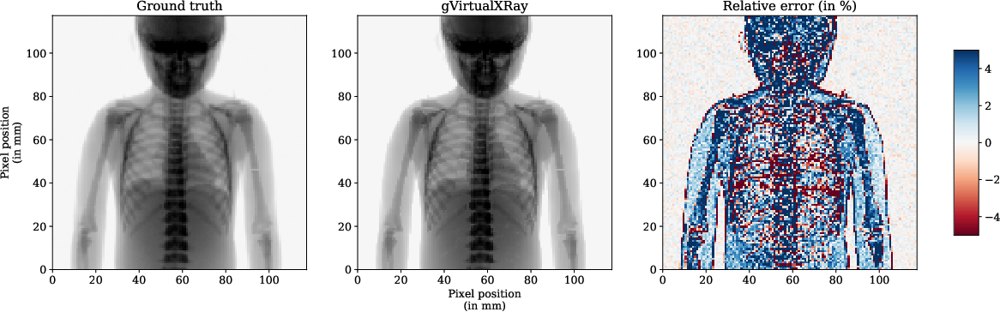{width="70%"}\
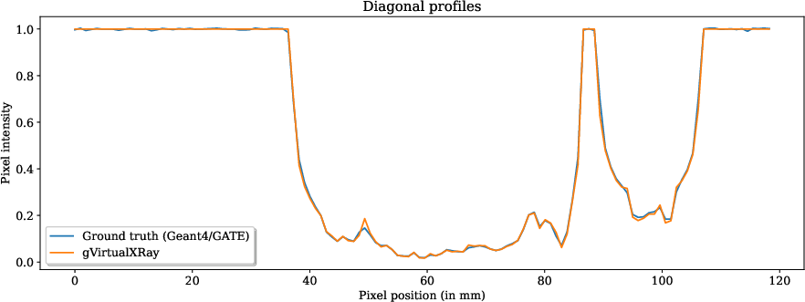{width="70%"}\
MAPE: 3.12%, ZNCC: 99.96%, SSIM: 0.99
:::
::::::

::: footer
^1^ Pointon et al. (2023), “Simulation of X-ray projections on GPU: Benchmarking gVirtualXray with clinically realistic
phantoms”
:::

# 5. Is gVXR validated? ^1^

::::: columns
::: column
-   Against state-of-the art **Monte Carlo simulation**, namely Geant4/Gate
-   Against **DRRs** computed from experimental data acquired with a **clinically utilized device**
:::

::: column
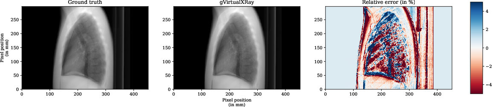{width=100%}\
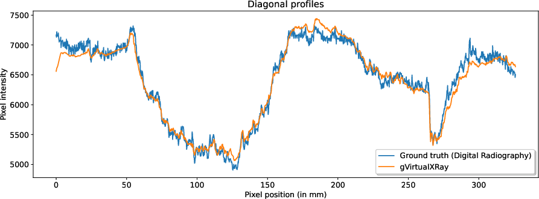{width=100%}\
MAPE: 1.76%, ZNCC: 99.66%, SSIM: 0.98
:::
::::::

::: footer
^1^ Pointon et al. (2023), “Simulation of X-ray projections on GPU: Benchmarking gVirtualXray with clinically realistic
phantoms”
:::


# 5. Is gVXR validated? ^1^

::::: columns
::: column
-   Against state-of-the art **Monte Carlo simulation**, namely Geant4/Gate
-   Against **DRRs** computed from experimental data acquired with a **clinically utilized device**
-   Against **digital radiographs** acquired with a **clinically utilized device**
:::

::: column
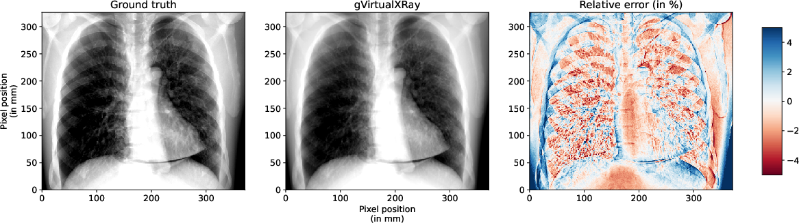{width=100%}\
{width=100%}\
MAPE: 1.56%, ZNCC: 98.91%, SSIM: 0.94
:::
::::::

::: footer
^1^ Pointon et al. (2023), “Simulation of X-ray projections on GPU: Benchmarking gVirtualXray with clinically realistic
phantoms”
:::


# 5. Is gVXR validated? ^1^

::::: columns
::: column
-   Against state-of-the art **Monte Carlo simulation**, namely Geant4/Gate
-   Against **DRRs** computed from experimental data acquired with a **clinically utilized device**
-   Against **digital radiographs** acquired with a **clinically utilized device**
-   Against **CT slices** from experimental data acquired with a **clinically utilized device**
:::

::: column
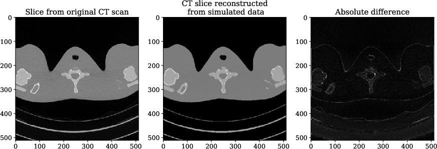{width=100%}\
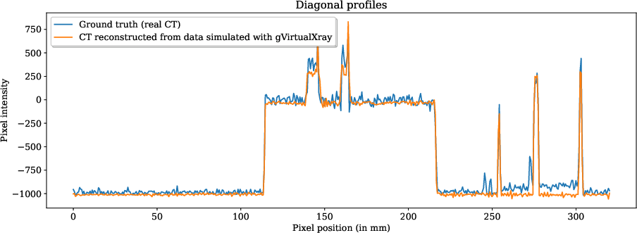{width=100%}\
MAPE: 4.46%, ZNCC: 99.05%, SSIM: 0.82
:::
::::::

::: footer
^1^ Pointon et al. (2023), “Simulation of X-ray projections on GPU: Benchmarking gVirtualXray with clinically realistic
phantoms”
:::

# Is gVXR fast? 

It was initially used in realtime medical VR for training
purposes. So speed and accuracy are both requirements and tradeoffs must
be found!

::::: columns
::: column
-   Spectrum: polychromatic with 50 energy bins
-   Resolution: 100 &times; 100 pixels
-   Flat field images: 10
-   Number of threads for the Monte Carlo simulation: 24
-   CPU: AMD Ryzen 5900X
-   GPU: NVIDIA GeForce RTX 4060 Ti
:::

::: column
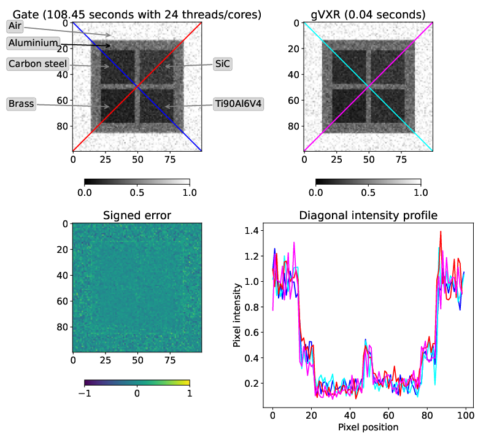{width=80%}
:::
:::::
::::::

# Runtimes

  ---------------------------------- --------------------- -------------------- ---------------------
           **Photon count**           **Execution time**    **Execution time**   **Speed-up factor**
                                         **with Gate**        **with gVXR**     
                                      **\[in hh:mm:ss\]**     **\[in ms\]**     
      100,000 &times; 11           00:01:47                 32                  3,378
      275,000 &times; 11           00:01:47                 32                  3,307
      775,000 &times; 11           00:01:48                 35                  3,090
     2,150,000 &times; 11          00:01:51                 34                  3,273
     6,000,000 &times; 11          00:01:57                 31                  3,812
    16,000,000 &times; 11          00:02:22                 36                  3,958
    46,000,000 &times; 11          00:05:24                 40                  8,059
    130,000,000 &times; 11         00:13:24                 36                 22,433
    360,000,000 &times; 11         00:36:34                 36                 60,783
   1,000,000,000 &times; 11        01:41:07                 31                 194,208
  ---------------------------------- --------------------- -------------------- ---------------------

# 6. CT simulation

```c++
void computeCTAcquisition(const std::string &  	aProjectionOutputPath,
		const std::string &  	aScreenshotOutputPath,
		unsigned int  	aNumberOfProjections,
		float  	aFirstAngle,
		bool  	anIncludeLastAngleFlag,
		float  	aLastAngle,
		unsigned int  	aNumberOfWhiteImagesInFlatField,
		float  	aPositionOfCentreOfRotationX,
		float  	aPositionOfCentreOfRotationY,
		float  	aPositionOfCentreOfRotationZ,
		const std::string &  	aUnitOfLength,
		float  	aAxisOfRotationX,
		float  	aAxisOfRotationY,
		float  	aAxisOfRotationZ,
		bool  	anIntegrateEnergyFlag = true,
		unsigned int  	aVerboseLevel = 0 
	)
```


# Jupyter Notebooks 8 & 9: Segmentation to simulation
- [magnification-simulation](https://github.com/TomographicImaging/gVXR-Tutorials/tree/main/notebooks/magnification-simulation.ipynb) 
  - We explore how to exploit the magnification to compute the pixel size in the object plane rather than flat 
    panel plane, 
  - how the source-to-detector distance affects the image quality in terms of noise, and 
  - the impact of sample material, noise and polychromatism on CT reconstructions.
  - [](https://colab.research.google.com/github/TomographicImaging/gVXR-Tutorials/blob/main/notebooks/magnification-simulation.ipynb)
 
- [magnification-reconstruction](https://github.com/TomographicImaging/gVXR-Tutorials/tree/main/notebooks/magnification-reconstruction.ipynb) 
  - We will exploit the simulation data generated using [`notebooks/magnification-simulation.ipynb`](notebooks/magnification-simulation.ipynb) 
  - to reconstruct the CT slices using the core imaging library (CIL), 
  - use the zero-mean, unit-variance normalisation to rescale pixel values, 
  - identify imaging artefacts by comparing pairs of images, and 
  - extract intensity profiles to assess noise and cupping artefacts.
  - [](https://colab.research.google.com/github/TomographicImaging/gVXR-Tutorials/blob/main/notebooks/magnification-reconstruction.ipynb)
 
[//]: # (![]&#40;img/jupyter-magnification-simulation.png&#41;{width=50%}<br/>)


# Jupyter Notebook 10: Segmentation to simulation
- [segmentation-to-CT_scan-simulation](https://github.com/TomographicImaging/gVXR-Tutorials/tree/main/notebooks/segmentation-to-CT_scan-simulation.ipynb) 
- Create a CT reconstruction from data simulated using a segmented image to model the sample.
- [](https://colab.research.google.com/github/TomographicImaging/gVXR-Tutorials/blob/main/notebooks/segmentation-to-CT_scan-simulation.ipynb)
 
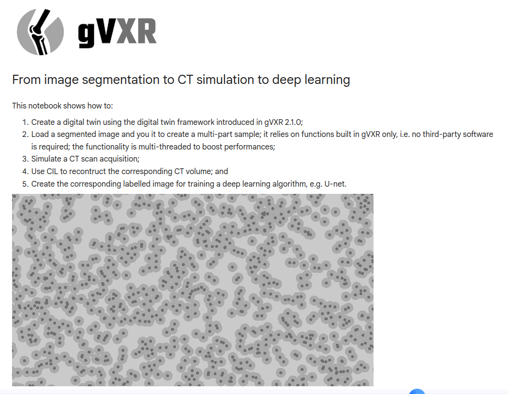{width=50%}<br/>

# Python script: Simulation to ML 
- [simulated_data_generation.py](https://github.com/TomographicImaging/gVXR-training-dXCT2026/blob/main/scripts/morning/simulated_data_generation.py)
- This script is very similar to the previous notebook. It makes use of the "XT H 225" twin. 
- It will, however, run loops over:
  - 6 samples
  - SOD: 150 mm +/- 20%
  - Current: 160 uA +/- 30%
  - Exposures: [0.5, 1.0, 1.42, 2.0] seconds, and 
  - Voltages in the range [180, 225].
- In total, 3600 CT slices and corresponding labels will be generated.

# 7. Other ways to use gVXR

- See
  - [https://gvirtualxray.sourceforge.io/tutorials/](https://gvirtualxray.sourceforge.io/tutorials/)
  - [https://github.com/TomographicImaging/gVXR-Tutorials](https://github.com/TomographicImaging/gVXR-Tutorials)
- Write the code to describe the previous parameters in pure
  {height=30px},
  {height=30px},
  { height=30px },
  { height=30px },
  { height=30px },
  { height=30px }, 
  { height=30px }, and 
  { height=30px }.
- Or use a more human friendly 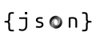{ height=30px } file.
- To simplify the {height=30px} code.

# JSON file (visualisation window)

``` {.JSON language="JSON" startFrom="1"}
{
    "Window size": [640, 480],
```

# JSON file (X-ray source)

``` {.JSON language="JSON" startFrom="3"}
"Source": {
        "Position": [0.0, -1500.0, 0.0, "mm"],
        "Shape": "POINT",
        "Beam": {
            "Peak kilo voltage": 160.0,
            "Tube angle": 12.0,
            "mAs": 0.5,
            "filter": [
                ["Cu", 1.0, "mm"]
            ]
        }
    },
```

# JSON file (X-ray detector)

``` {.JSON language="JSON" startFrom="15"}
"Detector": {
        "Position": [0.0, 400.0, 0.0, "mm"],
        "UpVector": [0, 0, -1],
        "RightVector": [-1.0, 0.0, 0.0],
        "NumberOfPixels": [512, 512],
        "Size": [256.0, 256.0, "mm"],
        "LSF": [0.0002, 0.0060, 0.0606, 0.2417, 
            0.3829, 0.2417, 0.0606, 0.0060, 0.0002],
        "Scintillator": {
            "Material": "CsI",
            "Thickness": 500.0,
            "Unit": "um"
        }
    },    
```

# JSON file (Sample)

``` {.JSON language="JSON" startFrom="29"}
"Samples": [
        {
            "Label": "Dragon",
            "Path": "welsh-dragon-small.stl",
            "Unit": "mm",
            "Material": ["Mixture", "Al6Ti90V4"],
            "Density": 4.43,
            "Type": "inner"
        }
    ],
```

# JSON file (CT scan acquisition)

``` {.JSON language="JSON" startFrom="39"}
"Scan": {
        "OutFolder": "projections",
        "GifPath": "screenshots",
        "NumberOfProjections": 200,
        "StartAngle": 0,
        "FinalAngle": 360,
        "IncludeLastAngle": true,
        "Flat-Field Correction": true,
        "NumberOfWhiteImages": 60,
        "CentreOfRotation": [0, 0, 0, "mm"],
        "RotationAxis": [0, 0, -1]
    }
}
```

# {height=60px} file (CT simulation)

``` {.python language="Python" startFrom="1"}
from gvxrPython3 import json2gvxr # Simulate X-ray images

json2gvxr.initGVXR("filename.json", renderer="OPENGL")
json2gvxr.initDetector()
json2gvxr.initSourceGeometry()
json2gvxr.initSpectrum()
json2gvxr.initSamples(verbose=0)
json2gvxr.initScan()
json2gvxr.doCTScan()
```

# {height=60px} file (CT reconstruction)

``` {.python language="Python" startFrom="1"}
from gvxrPython3.JSON2gVXRDataReader import *
from cil.processors import TransmissionAbsorptionConverter
from cil.framework import AcquisitionData
from cil.recon import FDK
from cil.io import TIFFWriter

reader = JSON2gVXRDataReader(file_name="filename.json")

data_absorption = TransmissionAbsorptionConverter(
    white_level=data_original.max())(data_original)
    
acquisition_data = AcquisitionData(data_absorption,
    geometry=data_absorption.geometry)
    
acquisition_data.reorder(order="tigre")

ig = acquisition_data.geometry.get_ImageGeometry()

fdk =  FDK(acquisition_data, ig)
recon = fdk.run()
TIFFWriter(data=recon, file_name="slices", "out")).write()
```

# Modern Web-based GUI

:::::: columns
::: column
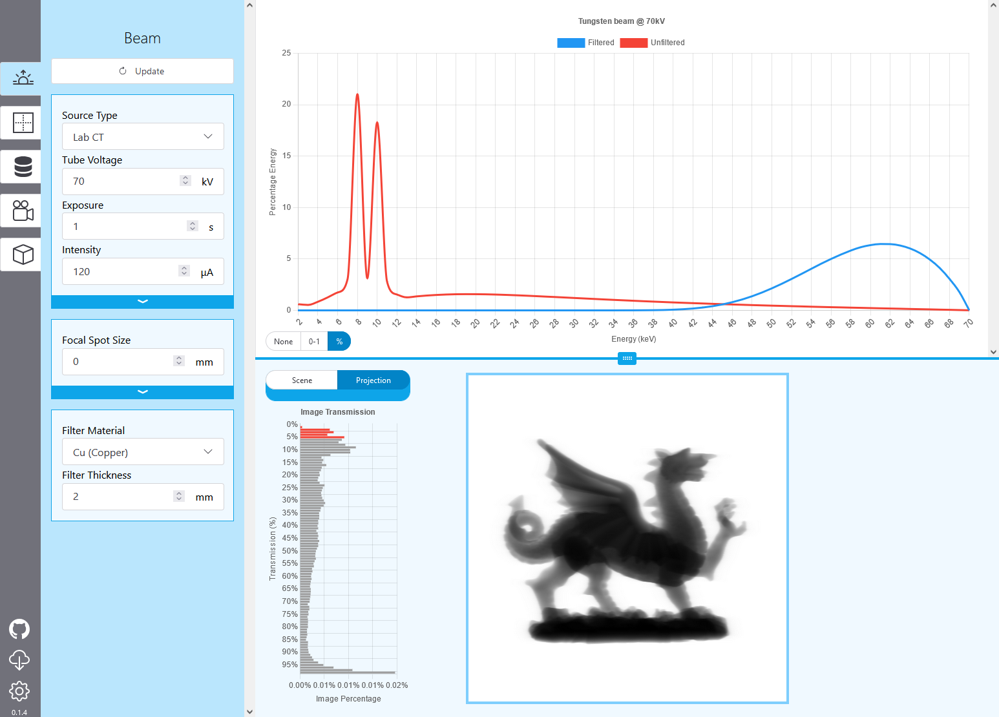{width=90%}
:::

:::: column
See video on YouTube {width=50%}

Download the latest release {width=50%}

Or visit <https://webct.io/>
:::
::::
::::::
:::::::

# Thanks

- For your attentions;
- The Ada support team, in particular Adam, Isaac, Jeremy and Peter; and 
- Our sponsors

{height=60px} 
{height=60px} 
{height=60px} 
{height=60px} 
{height=60px} 
{height=60px} 
{height=60px} 
{height=60px} 
